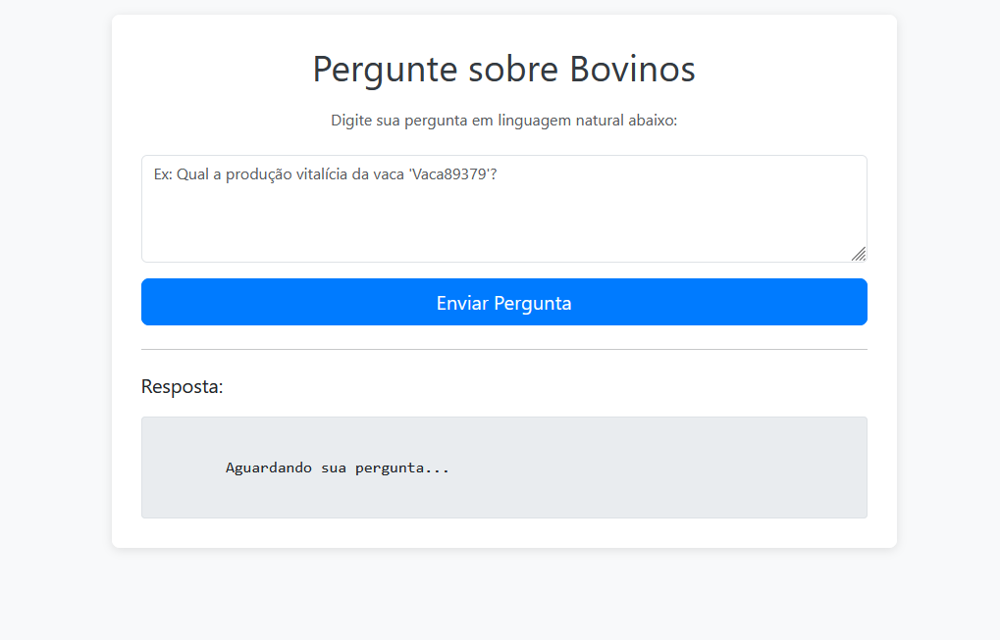

🐄 Sistema de Controle Leiteiro 
---
📋 Sobre o Projeto

Desafio: Uso de LLMs para geração de consultas e relatórios AD-HOC (Text-to-SQL).

Este projeto é uma prova de conceito (PoC) desenvolvida para a XXV Semana da Computação da UFJF. A aplicação utiliza Inteligência Artificial Generativa (LLMs) rodando localmente para converter perguntas em linguagem natural em consultas de banco de dados, permitindo a análise de dados de controle leiteiro e genealogia bovina sem necessidade de conhecimento técnico em SQL.
🏆 (Tema T1. NoCode)

O objetivo é criar uma interface onde o usuário possa fazer perguntas complexas sobre dados genealógicos e de produção animal e obter respostas precisas em linguagem natural.

Requisitos atendidos:

    ✅ Uso de Private LLM: A IA roda localmente (Ollama) garantindo privacidade e funcionamento offline. 
    
    ✅ Perguntas em Linguagem Natural: O usuário não digita código.
    
    ✅ Geração de Consultas (Text-to-SQL): A LLM traduz a intenção do usuário para a linguagem do banco de dados.

    ✅ Base de Dados: Importação de dados CSV (Genealogia e Controle Leiteiro).

🛠️ Tecnologias Utilizadas

    Linguagem: Java 

    Framework: Spring Boot 3.5.x

    IA & Integração:

        Spring AI: Orquestração e integração com modelos.

        Ollama: Servidor local de LLM.

        Modelo: Llama3:8b (via Ollama).

    Banco de Dados: PostgreSQL

    Ferramentas: Maven, Lombok, DevTools, Hibernate...
    
🚀 Arquitetura da Solução

    Input: Usuário envia uma pergunta (ex: "Qual touro tem filhas com maior média de lactação?").

    Prompt Engineering: O Spring AI constrói um prompt contendo o esquema do banco de dados e a pergunta.

    Inferência (Local): O Ollama processa o pedido e gera uma query SQL válida.

    Execução: O Backend executa a query no banco de dados.

    Resposta: Os dados retornados são passados de volta para a LLM, que gera uma resposta amigável em texto para o usuário.

🧪 Exemplos de Perguntas Suportadas

Baseado no cenário de Controle Leiteiro proposto no desafio:

    "Forneça a genealogia até a terceira geração do animal 'XPTO'."

    "Identifique o touro que possui a maior média de lactação de suas filhas ao primeiro parto."

    "Pode me fornecer as lactações encerradas e número de partos da vaca 'NANA'?"

    "Qual touro possui as filhas com a maior média de produção?"

